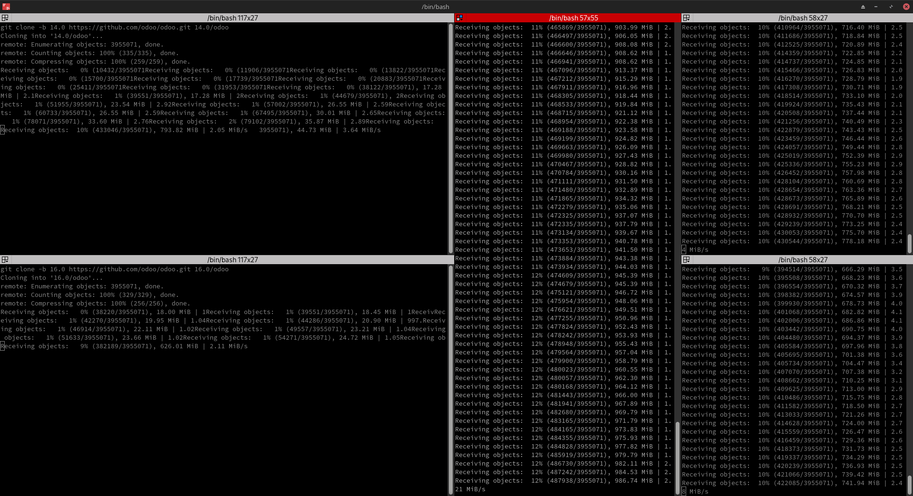

# Odoo Development Help

This repo contains publicly found info and original scripts that help with odoo development

---

## Scripts

## Cloning odoo

A bash script that clones all the odoo versions in one place at the same time: [here](./scripts/multi_clone.sh)

## Setting up the virtual environment

A [bash script](./scripts/set_up_venv.sh) that finds all the `requirements.txt` files and installs them with `pip` in the project's directory. The script accepts two inputs. The first is the parent directory of both the community and enterprise source code of odoo and the second the directory of the current worked upon project.
