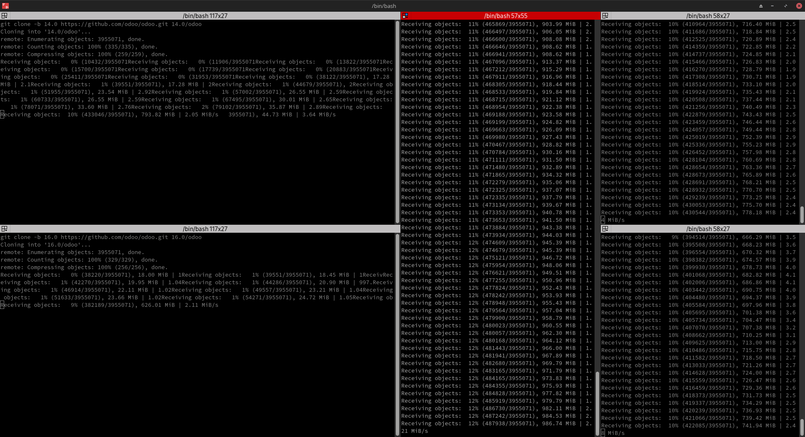

# Odoo Development Help

This repo contains publicly found info and original scripts that help with odoo development

---

## Scripts

## Cloning odoo

A bash script that clones all the odoo versions in one place at the same time: [here](./scripts/multi_clone.sh)

